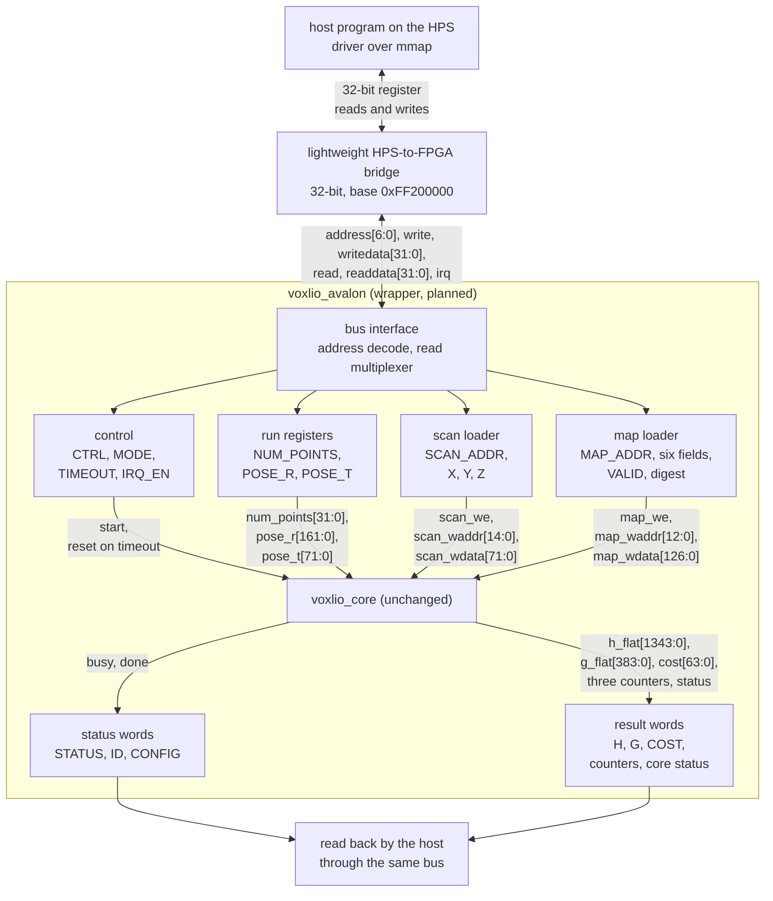

# Host interface (designed, not built)

How the host CPU on the DE10-Nano will reach the core. `rtl/voxlio_core.sv`
has 496 input bits besides clock and reset, 1,922 output bits and no bus.
This document specifies the wrapper that puts them behind 32-bit registers
on the HPS bridge.

State on 2026-10-06: this is a design. No wrapper RTL, host driver or test
for it exists, and nothing below has been simulated or synthesised. The
core's own ports are in [rtl.md](rtl.md) and its word formats in
[architecture.md](architecture.md#data-definitions).

## Decisions

| Question | Choice | Reason |
|---|---|---|
| Where the bus logic lives | a wrapper module, `voxlio_avalon`, around the unchanged core | the core stays bit-exact with the C++ model, and every existing test still applies |
| Bus | one 32-bit memory-mapped (Avalon-MM) slave on the lightweight HPS-to-FPGA bridge | every CPU write is one whole word; it is the path of the board manual's worked example |
| Clock | one 100 MHz clock from a PLL on the 50 MHz board oscillator, shared by the bridge's fabric side, the wrapper and the core | no clock-domain crossing |
| Reset | the HPS reset to the fabric, held until the PLL has locked | |
| Completion | the host polls a status bit; an interrupt line is wired and optional | polling needs no kernel driver |

The 128-bit HPS-to-FPGA bridge was considered for loading the memories. Its
HPS side is 64 bits wide (board manual, Figure 7-1) and the Cortex-A9 stores
32 or 64 bits at a time, so a 72-bit or 127-bit word would still arrive in
pieces and need the same holding registers. If loading proves too slow, the
same 32-bit slave can be connected to that bridge set to 32 bits; that is a
change in Platform Designer, not in the RTL.

## Structure



The wrapper cuts every wide port of the core into 32-bit slices. Writes are
collected in holding registers and handed to the core in a single cycle, so
the core still sees ordinary 72-bit and 127-bit memory writes and a stable
pose, exactly as the testbench drives it today. Results are not copied: the
core's own result registers hold their values after `done`, and a read
multiplexer returns one 32-bit slice per bus read.

By count of the registers below, the wrapper holds roughly 550 flip-flops
plus a 60-way read multiplexer, without the digest block. That is an
estimate, not a synthesis result.

## Bus

| Signal | Direction | Meaning |
|---|---|---|
| `clk`, `reset_n` | in | the shared 100 MHz clock and its reset |
| `address[6:0]` | in | word address; byte offset divided by four |
| `write`, `writedata[31:0]` | in | a write takes effect on the clock edge that samples `write` |
| `read`, `readdata[31:0]` | in, out | read data is valid one cycle after `read` |
| `irq` | out | high while an enabled interrupt is pending |

The slave never stalls. Platform Designer converts the bridge's AXI to this
form. The lightweight bridge starts at `0xFF200000` in the HPS address map;
the slave's offset inside the bridge is assigned in Platform Designer.

## Register map

The slave spans 512 bytes. Offsets are in bytes and every register is 32
bits. Unlisted offsets read zero and ignore writes. "Locked" registers
ignore writes while a run is busy and flag the attempt.

| Offset | Name | Access | Reset | Contents |
|---|---|---|---|---|
| `0x000` | `ID` | read | `0x564C494F` | the ASCII letters `VLIO` |
| `0x004` | `VERSION` | read | `0x00000001` | interface version: major in bits 31:16, minor in 15:0 |
| `0x008` | `CONFIG0` | read | 32768 | `MAX_POINTS` |
| `0x00C` | `CONFIG1` | read | | `NX` in 7:0, `NY` in 15:8, `NZ` in 23:16, `NEIGHBOR_RADIUS` in 31:24 |
| `0x010` | `CONFIG2` | read | | `coord_t` width in 7:0 and fraction bits in 15:8; `normal_t` width in 23:16 and fraction bits in 31:24 |
| `0x014` | `CONFIG3` | read | | `compute_t` width in 7:0 and fraction bits in 15:8; `accum_t` width in 23:16 and fraction bits in 31:24 |
| `0x020` | `CTRL` | write | | bit 0 `START`, bit 1 `CLEAR_ERRORS`, bit 2 `IRQ_ACK`; reads zero |
| `0x024` | `STATUS` | read | 0 | see the bit table below |
| `0x028` | `IRQ_EN` | read/write | 0 | bit 0: raise the interrupt when a run finishes |
| `0x02C` | `NUM_POINTS` | read/write, locked | 0 | number of points to process |
| `0x030` | `TIMEOUT` | read/write, locked | 2,098,176 | cycle limit for one run; 0 disables it |
| `0x034` | `MODE` | read/write, locked | 0 | map mode in bits 1:0; a write needs the key `0x4D4150` in bits 31:8 |
| `0x040 + 4i` | `POSE_R[i]`, i = 0 to 8 | read/write, locked | 0 | rotation, row-major, 18-bit signed |
| `0x064 + 4i` | `POSE_T[i]`, i = 0 to 2 | read/write, locked | 0 | translation, 24-bit signed |
| `0x080` | `SCAN_ADDR` | read/write, locked | 0 | index of the next point to write |
| `0x084`, `0x088` | `SCAN_X`, `SCAN_Y` | write, locked | | 24-bit signed; held |
| `0x08C` | `SCAN_Z` | write, locked | | commits `{z, y, x}` at `SCAN_ADDR`, then adds one to it |
| `0x0A0` | `MAP_ADDR` | read/write, locked | 0 | address of the next voxel to write |
| `0x0A4` to `0x0AC` | `MAP_CX`, `MAP_CY`, `MAP_CZ` | write, locked | | centroid, 24-bit signed each; held |
| `0x0B0` to `0x0B8` | `MAP_NX`, `MAP_NY`, `MAP_NZ` | write, locked | | normal, 18-bit signed each; held |
| `0x0BC` | `MAP_VALID` | write, locked | | bit 0 is the valid flag; commits the 127-bit word at `MAP_ADDR`, then adds one to it |
| `0x0C0 + 4i` | `MAP_DIGEST[i]`, i = 0 to 7 | write, locked | 0 | expected digest of the map, 256 bits |
| `0x100 + 8k` | `H[k]`, k = 0 to 20 | read | | packed `H`, `accum_t` raw bits: low word, then high word at `+4` |
| `0x1A8 + 8i` | `G[i]`, i = 0 to 5 | read | | low word, then high word at `+4` |
| `0x1D8` | `COST` | read | | low word, then high word at `0x1DC` |
| `0x1E0` | `INLIER_COUNT` | read | | |
| `0x1E4` | `PROCESSED_COUNT` | read | | |
| `0x1E8` | `REJECTED_COUNT` | read | | |
| `0x1EC` | `CORE_STATUS` | read | | the core's status word ([architecture.md](architecture.md#status-word-and-edge-cases)) |

The result block is 60 words, 240 bytes. The default `TIMEOUT` is
`64 * MAX_POINTS + 1024` cycles; a full scan of inliers takes
`48 * MAX_POINTS`.

`STATUS` bits:

| Bit | Name | Meaning |
|---:|---|---|
| 0 | `BUSY` | a run is in flight |
| 1 | `DONE` | the last run finished, normally or by timeout; cleared by `START` |
| 2 | `MAP_SEALED` | the map is in query mode and its digest matched |
| 3 | `IRQ_PENDING` | set when a run finishes; cleared by `IRQ_ACK` or `START` |
| 4 | `SEAL_BUSY` | a seal request is still computing the digest |
| 8 | `WRITE_WHILE_BUSY` | a locked register was written during a run |
| 9 | `START_REFUSED` | `START` arrived during a run or while the map was not sealed |
| 10 | `BAD_FIELD` | a written value did not fit its field |
| 11 | `TIMEOUT` | the last run hit the cycle limit and the core was reset |
| 12 | `DIGEST_MISMATCH` | a seal request found a different digest |
| 13 | `WRITE_REFUSED` | a map write outside update mode, a commit past the end of a memory, or a `MODE` write with a wrong key |

Bits 8 to 13 are sticky and are cleared by `CTRL.CLEAR_ERRORS`.

Map modes:

| `MODE` | Name | Map writes | `START` |
|---:|---|---|---|
| 0 | clear | refused | refused |
| 1 | update | accepted | refused |
| 2 | query | refused | accepted |

Any mode can go to clear. Clear or query can go to update, which sets
`MAP_ADDR` to zero and restarts the digest. Update to query is the seal: it
succeeds when the digest of the words written since update began equals
`MAP_DIGEST`; otherwise the mode stays update and `DIGEST_MISMATCH` is set.

The digest is SHA-256 over the 8192 map words in address order, each as 16
bytes, least significant byte first, with bit 127 zero. An update therefore
writes every voxel, in address order. `MAP_DIGEST[i]` holds the i-th 32-bit
word of the digest in the order SHA-256 defines them.

## Number formats on the bus

Field values are the raw fixed-point integers of
[architecture.md](architecture.md#number-types), written as 32-bit signed
integers: 24 significant bits for coordinates, 18 for normals and rotation
elements. The host converts a real value `v` with `round(v * 2^F)` and
saturates it, as the testbenches do. The upper bits of a write must be the
sign extension of the field; if they are not, the low bits are stored and
`BAD_FIELD` is set. `H`, `G` and `COST` are raw 64-bit `accum_t` integers,
read as two words; the value is the integer divided by `2^32`.

## Sequences

```text
probe   read ID, VERSION, CONFIG0..3; stop if they differ from the driver's constants

map     MODE <- key | update
        8192 x { MAP_CX, MAP_CY, MAP_CZ, MAP_NX, MAP_NY, MAP_NZ, MAP_VALID }
        MAP_DIGEST[0..7] <- expected digest
        MODE <- key | query
        poll STATUS until SEAL_BUSY = 0; check MAP_SEALED

scan    SCAN_ADDR <- 0
        N x { SCAN_X, SCAN_Y, SCAN_Z }
        NUM_POINTS <- N

pass    POSE_R[0..8], POSE_T[0..2] <- pose
        CTRL <- START
        poll STATUS until DONE; check the error flags
        read H, G, COST, the three counters and CORE_STATUS
```

The map is loaded when it changes, the scan once per scan, and a pass once
per iteration of the host loop. The host solves the 6 x 6 system after each
pass, updates the pose and runs the next pass on the same scan.

## What the wrapper enforces

- **Busy lock.** The core needs its inputs stable during a run. Writes to
  the scan, the map, the pose, the point count and the mode are ignored
  while `BUSY` is set, and `WRITE_WHILE_BUSY` records the attempt.
- **Map lock.** The map can be written only in update mode, and a run can
  start only in query mode. The key on `MODE` keeps a stray write from
  changing it.
- **Map digest.** Sealing compares what was written against the digest the
  host expects, so a map corrupted between the builder and the memory is
  refused before any point is processed.
- **Watchdog.** A run that exceeds `TIMEOUT` cycles is ended: the core is
  reset, `TIMEOUT` and `DONE` are set, and the result words are not valid.
- **Frozen results.** The result words hold from `DONE` until the next
  `START`, so reading them as 60 separate words is safe.
- **Identity.** `ID`, `VERSION` and `CONFIG` let the driver refuse a
  bitstream built with another grid or other number formats, as the
  testbench refuses stale test vectors today.

## Bus traffic

| Step | Transfers | For the `room` case |
|---|---|---|
| Map load | 7 writes per voxel | 57,344 writes |
| Scan load | 3 writes per point | 41,850 writes for 13,950 points |
| One pass | 13 writes, then 60 reads and the status polls | |

How long one transfer takes through the bridge has not been measured. It
adds to the time per scan and belongs in the board benchmark.

## Verification plan

- The Verilator testbench drives the wrapper through bus read and write
  helpers instead of the raw ports. Every existing scenario (four vectors,
  30 directed, 8 random) must still match the fixed-point C++ core bit for
  bit.
- One directed test per guard: a write during a run, a start with the map
  unsealed, a map write outside update mode, a wrong key, a value that does
  not fit its field, a run that hits the timeout, a digest mismatch.
- Planted bugs in the wrapper are added to `make mutation`.
- The host driver is written on two functions, a 32-bit read and a 32-bit
  write. In simulation they call the Verilator model; on the board they
  access the bridge through `mmap`. The same driver source is tested before
  the board exists.

## Not in this version

- Loading through the wide HPS-to-FPGA bridge.
- Reading the scan from HPS memory through the FPGA-to-HPS bridge, which
  would also free the 2.36 Mbit scan buffer.
- Reading the two memories back.
- Queuing more than one scan.

## Open points

- The time of one transfer through the bridge, and with it the cost of
  loading a scan.
- How the digest block is fed: while the map is written, or by reading the
  map RAM back when the seal is requested. The second needs access to the
  map RAM's read port, which is a change to the core. The registers above
  are the same either way.
- Until the digest block is built, a seal request succeeds without a check.
- Whether a value that does not fit its field should refuse the commit
  instead of storing the low bits.
- Which FPGA-to-HPS interrupt line `irq` uses.
