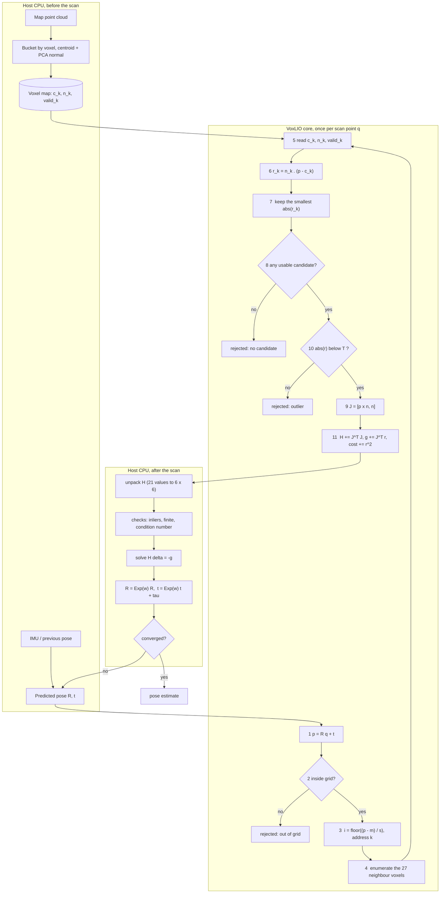

# The mathematics of each stage

This document explains what every stage of VoxLIO computes and why. It
follows the stage numbering used throughout the code in `hls/`. The
flowchart is Mermaid; GitHub and VS Code render it.

## Data flow



The core runs stages 1 to 11 for every point and keeps only the running
sums. The host closes the loop: it solves a 6 x 6 system, moves the pose and,
if the step was not small, sends the same scan again with the new pose. The
inlier test (stage 10) is applied before the Jacobian (stage 9) in the code,
because a rejected point needs no Jacobian; the result is the same.

## Notation

| Symbol | Meaning |
|---|---|
| $q$ | scan point in the LiDAR frame |
| $p$ | the same point in the map frame |
| $R, t$ | predicted pose, rotation matrix and translation, $p = Rq + t$ |
| $m = (x_{min}, y_{min}, z_{min})$ | minimum corner of the voxel grid |
| $s$ | voxel size, 0.5 m |
| $N_x, N_y, N_z$ | grid dimensions, 32 x 32 x 8 |
| $c_k, n_k$ | centroid and unit normal stored in voxel $k$ |
| $r$ | signed point-to-plane distance |
| $\delta = (\omega, \tau)$ | pose correction: rotation vector and translation, 6 values |
| $J$ | 1 x 6 row: derivative of $r$ with respect to $\delta$ |
| $H, g$ | $\sum J^T J$ (6 x 6) and $\sum J^T r$ (6 x 1) over the inliers |
| $T$ | inlier threshold, 0.30 m |

## Stage 1: point transform

$$p = R\,q + t$$

Written out, with $R$ stored row-major as $r_{00} \ldots r_{22}$:

```text
px = r00*qx + r01*qy + r02*qz + tx
py = r10*qx + r11*qy + r12*qz + ty
pz = r20*qx + r21*qy + r22*qz + tz
```

Nine multiplications and nine additions. $R$ must be a rotation matrix
(orthonormal, determinant +1); the core does not check this, the host
guarantees it. The three rows are independent, which is what makes the stage
easy to pipeline.

## Stages 2 and 3: bounds check and voxel index

The grid coordinate of $p$ in voxel units is

$$f = (p - m) \cdot \frac{1}{s}$$

computed per axis. The point is inside the grid when

$$0 \le f_a < N_a \quad \text{for } a \in \{x, y, z\}$$

which is the same condition as $m_a \le p_a < m_a + N_a s$ in exact
arithmetic. The code tests $f$ rather than $p$ because $f$ is the value that
is truncated next; this guarantees that the index is in range even when
floating-point rounding pushes a point sitting just inside the far face onto
it. NaN fails both comparisons, so non-finite points are rejected here.

The voxel index is

$$i_a = \lfloor f_a \rfloor$$

Since $f_a \ge 0$ after the check, floor is plain truncation. The division is
replaced by a multiplication with the constant $1/s$; for $s = 0.5$ the
constant is exactly 2, so the product is exact in floating point and a one-bit
shift in fixed point.

The 3-D index becomes a memory address by laying the grid out with $x$
fastest, then $y$, then $z$:

$$k = i_z N_x N_y + i_y N_x + i_x, \qquad 0 \le k < N_x N_y N_z = 8192$$

This is the row-major order of a `[NZ][NY][NX]` array. The inverse is
$i_x = k \bmod N_x$, $i_y = \lfloor k / N_x \rfloor \bmod N_y$,
$i_z = \lfloor k / (N_x N_y) \rfloor$.

## What "plane" means in stages 4 to 7

The map is not kept as points. Before the scan, the host reduces the map
points inside each 0.5 m voxel to two things: the **centroid** $c$, their
average position, which lies on the surface, and the **normal** $n$, the
unit-length direction perpendicular to the surface, found by PCA (the
direction in which the points spread least; see the map builder section
below). Together they define the infinite plane

$$\{\, x : n \cdot (x - c) = 0 \,\}$$

which is the local flat approximation of whatever surface fragment passed
through the cube: a piece of floor, a piece of wall. Within half a metre most
real surfaces are flat enough for this to lose very little.

```text
side view of one floor voxel            what gets stored

 z   .  .   .  .    .   .                n = (0, 0, 1)   points "up"
 ^  . .  . c .  . .  . .     -->   ------c-----------------  the plane n.(x - c) = 0
 |                                       (extends beyond the voxel)
 +---------------------> x
```

A floor voxel stores something like $c = (\bar x, \bar y, 0)$, $n = (0, 0, 1)$;
a voxel on the wall at $x = 4$ stores $c = (4, \bar y, \bar z)$, $n = (1, 0, 0)$.

Stages 4 to 7 answer, for each scan point, *which surface was this point
measured on, and how far off is the predicted pose putting it?* Each valid
voxel in the neighbourhood offers one **candidate plane**, one hypothesis
"this point belongs to that surface fragment". Stage 6 measures the signed
distance from the point to every candidate; because the plane is infinite,
that is the distance to the extension of the fragment, which is why the
search is confined to the 27 nearest voxels. Stage 7 keeps the closest one.
In ICP terms this is the correspondence step: the nearest map *plane* rather
than the nearest map *point*.

Planes rather than points because: a point anywhere on the surface has zero
residual, so it can slide along the floor without being pulled toward one
particular map point; six numbers per voxel replace a hundred points; and
the residual is signed, which tells the solver whether to move up or down.

Example: $p = (3.9, 1.0, 0.02)$ near the floor-wall corner sees both planes,
with floor residual $0.02$ and wall residual $3.9 - 4.0 = -0.1$; the floor
wins. The weakness shows in voxels where two surfaces meet: PCA then returns
a diagonal normal for a plane that exists nowhere, which the optional
planarity gate of the map builder filters out.

## Stage 4: neighbour enumeration

The point's own voxel is not always the one that holds the surface it lies
on: the pose is only predicted, so the point may have landed just across a
voxel face, and a surface close to a face is described by the voxel on the
other side. The search therefore covers the cube of offsets

$$d \in \{-1, 0, 1\}^3, \qquad (i_x + d_x,\ i_y + d_y,\ i_z + d_z)$$

visited with $d_z$ outermost and $d_x$ innermost. Offsets that leave the grid
are skipped, so a point in a face voxel sees 18 candidates, in an edge voxel
12, in a corner voxel 8. Each candidate address is range-checked per axis
before it is formed; that is the only thing standing between the core and an
out-of-bounds read.

## Stage 5: voxel read

Each voxel stores the plane through its map points: the centroid $c_k$, a
unit normal $n_k$ and a valid flag. A descriptor is usable when the flag is
set and the normal is not the zero vector (a zero normal would give $r = 0$
for every point and win every search).

## Stage 6: point-to-plane residual

A plane through $c$ with unit normal $n$ is the set of points $x$ with
$n \cdot (x - c) = 0$. For any point $p$,

$$r = n \cdot (p - c) = n_x (p_x - c_x) + n_y (p_y - c_y) + n_z (p_z - c_z)$$

is the signed distance from $p$ to the plane: positive on the side the normal
points to, negative on the other, and equal to the shortest distance only
because $|n| = 1$. Three subtractions, three multiplications, two additions.
The sign carries information: a point above the floor and a point below it
must pull the pose in opposite directions, and $r$ is what tells them apart.

## Stage 7: best plane selection

Among the usable candidates the core keeps

$$k^\ast = \arg\min_k \lvert r_k \rvert$$

the first one in visiting order when two are equal. The idea is that the
plane a point lies closest to is the surface it was measured on. This is the
v0.1 rule. The experiment log (entry 4) shows a side effect:
when a point sees several voxels of the same surface, each with a slightly
different fitted plane, the smallest $\lvert r \rvert$ among them is
systematically smaller than the true distance.

## Stage 8 and 10: residual and inlier test

The residual of the point is $r = r_{k^\ast}$. It is accepted when

$$\lvert r \rvert < T$$

with $T = 0.30$ m. Points farther than that from every nearby plane are
clutter, moving objects or wrong associations, and would pull the solution
toward themselves; they are counted as rejected and contribute nothing. The
comparison is strict, so $\lvert r \rvert = T$ is rejected.

## Stage 9: Jacobian

The Jacobian answers: if the pose moves a little, how much does $r$ change?
The pose is perturbed on the left, in the map frame:

$$R \leftarrow \mathrm{Exp}(\omega)\, R, \qquad t \leftarrow \mathrm{Exp}(\omega)\, t + \tau$$

so that the transformed point moves to $p' = \mathrm{Exp}(\omega)\,p + \tau$.
For a small rotation vector $\omega$, $\mathrm{Exp}(\omega) \approx I + [\omega]_\times$,
where $[\omega]_\times v = \omega \times v$. Hence

$$p' \approx p + \omega \times p + \tau$$

and the residual against a fixed plane becomes

$$r' = n \cdot (p' - c) \approx r + n \cdot (\omega \times p) + n \cdot \tau$$

The scalar triple product is invariant under cyclic permutation,
$n \cdot (\omega \times p) = \omega \cdot (p \times n)$, which gives

$$r' \approx r + (p \times n) \cdot \omega + n \cdot \tau = r + J\,\delta,
\qquad J = \big[\,(p \times n)^T \;\; n^T\,\big]$$

With the cross product written out:

```text
J0 = py*nz - pz*ny
J1 = pz*nx - px*nz
J2 = px*ny - py*nx
J3 = nx
J4 = ny
J5 = nz
```

Six multiplications and three subtractions; the last three entries are
copies. The hand-computed check case $p = (1, 2, 3)$, $n = (0, 0, 1)$ gives
$p \times n = (2 \cdot 1 - 3 \cdot 0,\ 3 \cdot 0 - 1 \cdot 1,\ 1 \cdot 0 - 2 \cdot 0) = (2, -1, 0)$,
so $J = (2, -1, 0, 0, 0, 1)$.

The first three entries say how the residual reacts to a rotation about the
map axes: a point far from the origin on a plane with a normal at right
angles to the lever arm reacts strongly. The last three say how it reacts to
translation: only motion along the normal changes a point-to-plane distance.

Had the perturbation been applied on the right, $R \leftarrow R\,\mathrm{Exp}(\omega)$,
the Jacobian would be $[(q \times R^T n)^T \;\; (R^T n)^T]$ instead, and the
host update would have to be the right-multiplicative one. The core and the
host use the left form throughout; `tests/test_geometry.py` checks $J$
against finite differences of the actual update.

## Stage 11: normal equations

Gauss-Newton minimises the sum of squared residuals after a pose correction
$\delta$, using the linearisation from stage 9:

$$E(\delta) = \tfrac{1}{2} \sum_{i \in \text{inliers}} \big(r_i + J_i \delta\big)^2$$

Setting the gradient to zero,

$$\sum_i J_i^T \big(r_i + J_i \delta\big) = 0
\quad\Longrightarrow\quad
\Big(\sum_i J_i^T J_i\Big)\,\delta = -\sum_i J_i^T r_i$$

that is $H\,\delta = -g$ with

$$H = \sum_i J_i^T J_i \;\; (6 \times 6), \qquad g = \sum_i J_i^T r_i \;\; (6 \times 1)$$

The core computes exactly these two sums, plus the cost $\sum r_i^2$ and the
counters. Every point adds a rank-one term $J^T J$ to $H$: 21 multiply-adds for
the upper triangle, 6 for $g$, 1 for the cost.

$H$ is symmetric and positive semi-definite, so only the upper triangle is
stored, column by column:

```text
k :  0 | 1  2 | 3  4  5 | 6  7  8  9 | 10 11 12 13 14 | 15 16 17 18 19 20
H : 00 | 01 11 | 02 12 22 | 03 13 23 33 | 04 14 24 34 44 | 05 15 25 35 45 55
```

$$H[k] = H_{ij}, \qquad k = i + \frac{j(j+1)}{2}, \qquad i \le j$$

Writing $a = p \times n$, the block structure of one term is

$$J^T J = \begin{pmatrix} a a^T & a n^T \\ n a^T & n n^T \end{pmatrix}$$

The translation block $\sum n n^T$ is the sum of the outer products of the
normals. If every inlier lies on one plane, all normals are parallel, this
block has rank 1 and $H$ is singular: a single plane only pins down the
motion along its normal and the two tilts about in-plane axes. Three planes
with independent normals, like the floor and two walls of the synthetic
room, make $H$ full rank. The host checks the condition number for this
reason.

Fixed-point sizing follows from the same sums. With every inlier inside the
grid, $|p| \le \rho = 11.9$ m (the corner of the grid), so $|a| \le \rho$ and
$|H_{ij}| \le N \rho^2 = 32768 \times 141 \approx 4.6 \times 10^6$, which
needs 24 signed integer bits; the accumulators have 32.

## Host side: solve and update

The host rebuilds the symmetric matrix, checks that there are enough inliers,
that $H$ and $g$ are finite and that $H$ is well conditioned, and solves

$$\delta = -H^{-1} g$$

A step that is too large is refused rather than applied. The pose is then
updated with the same left perturbation that the Jacobian assumed:

$$R \leftarrow \mathrm{Exp}(\omega)\,R, \qquad t \leftarrow \mathrm{Exp}(\omega)\,t + \tau$$

where $\mathrm{Exp}$ is Rodrigues' formula with $\theta = |\omega|$:

$$\mathrm{Exp}(\omega) = I + \frac{\sin\theta}{\theta}[\omega]_\times
 + \frac{1 - \cos\theta}{\theta^2}[\omega]_\times^2$$

The linearisation is only valid near the current pose and the plane each
point is matched to can change as the pose improves, so the host iterates:
new pose, same scan, new $H$ and $g$. At the solution $g$ goes to zero. On
the synthetic room the first step removes about 85 % of the error and five
steps reach a millimetre (`results/benchmark/pose_convergence.md`).

## Map builder: centroid and normal by PCA

This runs on the CPU before the scan. Map points are
bucketed with the same index formula as stage 3. For a voxel with points
$x_1 \ldots x_N$, $N \ge$ `MIN_POINTS`:

$$c = \frac{1}{N}\sum_j x_j, \qquad
C = \frac{1}{N}\sum_j (x_j - c)(x_j - c)^T$$

The plane through $c$ that fits the points best in the least-squares sense is
the one whose normal minimises $\sum_j (n \cdot (x_j - c))^2 = N\, n^T C n$
subject to $|n| = 1$. That minimum is the smallest eigenvalue
$\lambda_0$ of $C$, attained at its eigenvector, so

$$n = \text{eigenvector of } C \text{ for } \lambda_0, \qquad
\text{RMS distance of the points to the plane} = \sqrt{\lambda_0}$$

The eigenvalues sorted $\lambda_0 \le \lambda_1 \le \lambda_2$ also say how
plane-like the bucket is: $\lambda_0 \ll \lambda_1$ for a thin sheet, three
comparable values for a blob, $\lambda_0 \approx \lambda_1$ for points along
an edge. The optional gate `max_thickness_ratio` rejects a voxel when
$\lambda_0 > \text{ratio} \cdot \lambda_1$.

An eigenvector is defined only up to sign. The builder makes the component
of largest magnitude positive so that the stored map is repeatable. The sign
cannot affect the result: flipping $n$ flips both $J$ and $r$, and
$J^T J$ and $J^T r$ are unchanged.

## Number formats

**Float build.** Every quantity is IEEE single precision: 24-bit significand,
relative resolution $6 \times 10^{-8}$. Expressions are evaluated in one fixed
order in all implementations, so results agree bit for bit.

**Fixed-point build.** A value of type `ap_fixed<W,I>` is an integer $v$
interpreted as $v \cdot 2^{-(W-I)}$: $W$ bits in total, $I$ of them (sign
included) before the binary point. Resolution is one LSB, $2^{-(W-I)}$; range
is $[-2^{I-1}, 2^{I-1})$.

| Type | Format | LSB | Range | Holds |
|---|---|---|---|---|
| `coord_t` | `<24,10>` | $2^{-14}$ = 61 µm | ±512 m | points, centroids, translation |
| `normal_t` | `<18,2>` | $2^{-16}$ = 1.5e-5 | ±2 | normals, rotation matrix |
| `compute_t` | `<32,16>` | $2^{-16}$ = 15 µm | ±32768 | residual, Jacobian |
| `accum_t` | `<64,32>` | $2^{-32}$ | ±2.1e9 | H, g, cost |

Products of two fixed-point numbers are exact (the result simply has the sum
of the widths). Quantisation happens only where a result is stored back into
one of these types: the transformed point (stage 1), the residual (stage 6)
and the Jacobian (stage 9). Truncation at those points always rounds toward
minus infinity, a bias of half an LSB in the same direction for every point,
and a bias that is the same for every point does not average out over a scan.
Rounding to nearest removes it; that is why `VOXLIO_QUANT` is `AP_RND`
(experiment log, entry 5).

## Worked example

Acceptance test 1: identity pose, one valid voxel holding the plane
$z = 0$ with $c = (0, 0, 0)$ and $n = (0, 0, 1)$, scan point
$q = (0.1, -0.05, 0.125)$.

| Stage | Computation |
|---|---|
| 1 | $p = q = (0.1, -0.05, 0.125)$ |
| 2, 3 | $f = ((0.1 + 8.25) \cdot 2,\ (-0.05 + 8.25) \cdot 2,\ (0.125 + 2.25) \cdot 2) = (16.7, 16.4, 4.75)$, inside; $i = (16, 16, 4)$; $k = 4 \cdot 1024 + 16 \cdot 32 + 16 = 4624$ |
| 4, 5 | 27 candidates; only voxel 4624 is valid |
| 6, 7 | $r = 0 \cdot 0.1 + 0 \cdot (-0.05) + 1 \cdot 0.125 = 0.125$ |
| 10 | $0.125 < 0.30$: inlier |
| 9 | $p \times n = (-0.05 \cdot 1 - 0.125 \cdot 0,\ 0.125 \cdot 0 - 0.1 \cdot 1,\ 0.1 \cdot 0 - (-0.05) \cdot 0) = (-0.05, -0.1, 0)$, so $J = (-0.05, -0.1, 0, 0, 0, 1)$ |
| 11 | $H_{00} = 0.0025$, $H_{01} = 0.005$, $H_{11} = 0.01$, $H_{05} = -0.05$, $H_{15} = -0.1$, $H_{55} = 1$, all others 0; $g = (-0.00625, -0.0125, 0, 0, 0, 0.125)$; cost $= 0.015625$ |

With one point $H$ has rank 1, so the host cannot solve for a pose from it;
that takes many points on at least three differently oriented planes. The
same numbers are asserted in `tests/test_reference_model.py` and
`testbench/tb_voxlio.cpp`.

## Operation count per point

For hardware sizing (open question Q2 in the experiment log), the arithmetic per scan point
when all 27 candidates are in the grid:

| Stage | Multiplications | Additions / subtractions | Other |
|---|---:|---:|---|
| 1 transform | 9 | 9 | |
| 2, 3 index | 3 | 3 | 6 comparisons, 3 truncations |
| 6, 7 candidates (x 27) | 81 | 135 | 27 abs, 27 comparisons |
| 9 Jacobian | 6 | 3 | |
| 11 accumulate | 28 | 28 | |
| total | 127 | 178 | |

Stages 6 and 7 dominate, and they are also the ones that need a memory read
per candidate. That is why the neighbourhood size and the selection rule are
the first things the optimisation roadmap and experiment log entry 4 look at.
