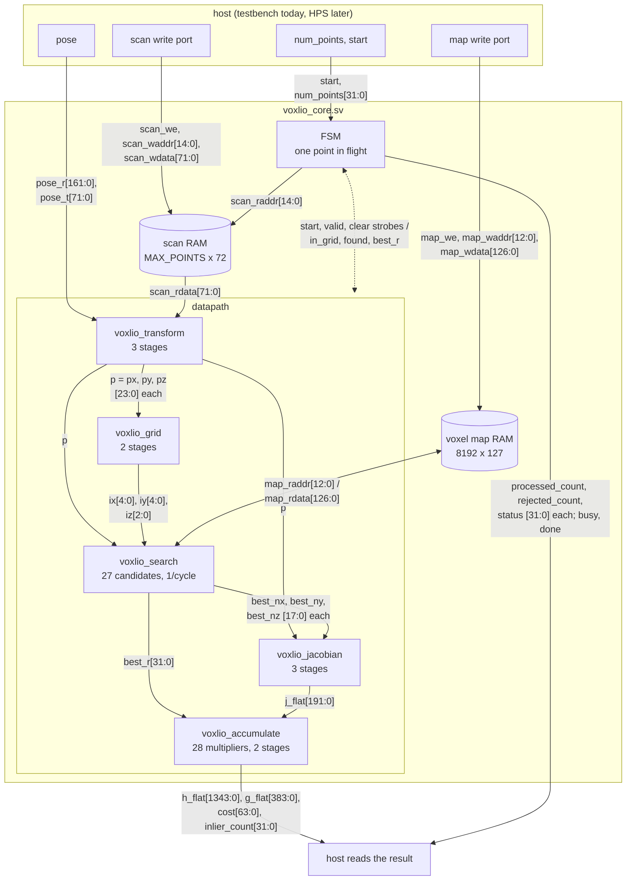

# RTL implementation (DE10-Nano / Cyclone V)

The hackathon board is a Terasic DE10-Nano: Intel Cyclone V SE SoC
(5CSEBA6U23I7, about 42k ALMs, 112 DSP blocks, 5.5 Mbit of M10K memory, a
dual-core Cortex-A9). No HLS tool targets this part in a usable way, so the
v0.1 core is written by hand in SystemVerilog under `rtl/`. It implements the
fixed-point configuration of `hls/voxlio_config.hpp` and is verified bit for
bit against the fixed-point C++ core.

## Structure



Every arrow is labelled with the signals it carries, named as in
`voxlio_core.sv`, with their bit ranges. A double-headed arrow is a two-way
link: the address to the map RAM and the word that comes back, or the FSM's
strobes to the datapath and the flags it gets back (the FSM uses `found` and
`best_r` for stages 8 and 10). Clock and reset are not drawn. The fields
inside the 72-bit scan word, the 127-bit map word, the pose and the result
buses are laid out in
[architecture.md](architecture.md#memory-words-and-ports-in-the-rtl).

| File | Stage | Pipeline |
|---|---|---|
| `voxlio_pkg.sv` | constants, generated from `voxlio_config.hpp` by `scripts/gen_rtl_pkg.py` | |
| `voxlio_round_sat.sv` | `ap_fixed` assignment: drop fraction bits with rounding or truncation, then saturate | combinational |
| `voxlio_ram.sv` | scan buffer and voxel map, simple dual port, read data one cycle after the address | |
| `voxlio_transform.sv` | 1 | products, sums, quantise: 3 cycles |
| `voxlio_grid.sv` | 2, 3 | constant multiply, truncate/compare: 2 cycles |
| `voxlio_search.sv` | 4 to 7 | one candidate issued per cycle, 5-stage residual pipeline, in-order best tracker |
| `voxlio_jacobian.sv` | 9 | products, differences, quantise: 3 cycles |
| `voxlio_accumulate.sv` | 11 | 28 products, then 64-bit adds: 2 cycles |
| `voxlio_core.sv` | 8, 10, control, status | FSM, one point at a time |

## Interface

```systemverilog
module voxlio_core (
  input  clk, rst_n,
  input  scan_we,  input [SCAN_AW-1:0] scan_waddr, input [SCAN_W-1:0] scan_wdata,
  input  map_we,   input [MAP_AW-1:0]  map_waddr,  input [MAP_W-1:0]  map_wdata,
  input  start,    input [31:0] num_points,
  input  [9*NORMAL_W-1:0] pose_r, input [3*COORD_W-1:0] pose_t,
  output busy, done,
  output [21*ACCUM_W-1:0] h_flat, output [6*ACCUM_W-1:0] g_flat, output [ACCUM_W-1:0] cost,
  output [31:0] inlier_count, processed_count, rejected_count, status);
```

Protocol: write the scan and the map through the two write ports (any
order, any time the core is idle), set `num_points` and the pose, pulse
`start` for one cycle, wait for `done` (a level, cleared by the next
`start`), read the results. All inputs must stay stable while `busy`. The
core never writes the map.

Word layouts, least significant field first:

| Memory | Word | Fields |
|---|---|---|
| scan | 72 bits | `x`, `y`, `z` as `coord_t` (24 bits each) |
| map | 127 bits | `cx`, `cy`, `cz` (24 each), `nx`, `ny`, `nz` as `normal_t` (18 each), `valid` (1) |

`pose_r` holds the nine rotation elements row-major, `pose_t` the three
translation elements, `h_flat` the 21 packed upper-triangle entries in the
packed order, each as the raw bits of an `accum_t`.

## Fixed-point mapping

Every place where the C++ model stores into a narrower type has one
`voxlio_round_sat` instance in the RTL, with the same drop count, rounding
mode (`VOXLIO_QUANT`) and saturation:

| C++ | RTL | Bits dropped | Saturate to |
|---|---|---|---|
| transformed point to `coord_t` | `voxlio_transform` | 16 (round) | 24 |
| grid coordinate to `grid_t` | `voxlio_grid` | 14 (truncate) | 26 |
| residual to `compute_t` | `voxlio_search` | 14 (round) | 32 |
| Jacobian to `compute_t` | `voxlio_jacobian` | 14 (round) | 32 |

Products and sums in between are exact, as they are in `ap_fixed`. The
accumulators add exact products into 64-bit registers that wrap, also as
in C++. `sat_abs` in the package reproduces `vox_abs`: the most negative
value becomes the most positive one.

The accumulator forms its products from the low 22 bits of each Jacobian
entry and the low 18 bits of the residual rather than the full 32. Every
Jacobian entry is bounded by twice the grid's corner radius (23.8 m) because
the point is inside the grid and normals are below 2, and every accumulated
residual is below the 0.30 m threshold, so the slices are exact for every
reachable value; the testbench asserts it on every accumulation. The 46
multipliers (9 transform, 3 residual, 6 Jacobian, 28 accumulate) are all
27x27 or smaller, the size of one Cyclone V DSP block in its widest mode.
The three constant multiplies in the grid stage are by 2 and should become
shifts. Which of this Quartus actually does is not known until it runs.

## Cycle counts (Verilator, cycle-accurate)

| Point outcome | Cycles |
|---|---|
| inlier | 48: fetch 2, transform and grid 5, search 34 (27 candidates + pipeline fill and drain), decide 1, Jacobian 3, accumulate 2, next 1 |
| rejected after the search | 43 |
| rejected by the bounds check | 8 |
| case `room`, 13,950 points | 665,932 cycles, 47.7 per point |

At 100 MHz that is 6.7 ms for the `room` scan. The plain C++ reference does
the same scan in 1.85 ms on one core of a laptop i3; the comparison that
matters for the board is against the Cortex-A9, which has not been measured.
The clock the core actually reaches is a Quartus result.

Where the cycles go is plain from the table: 27 per point are the
sequential candidate walk that v0.1 prescribes, and about 14 are pipeline
bubbles because only one point is in flight. Overlapping the next point's
transform with the current search removes most of the bubbles without
touching the algorithm; the walk itself is the subject of experiment log
entry 4.

## Verification

`make rtl` builds the Verilator model with `-Wall` and runs
`testbench/tb_rtl.cpp`, which for every scenario runs the fixed-point C++
core and the RTL on identical inputs and requires identical raw bits in all
21 `H` entries, `g`, cost, the three counters and the status word:

- the four exported test vectors (`room`, `room_face_aligned`, two seeds):
  bit-exact, which `scripts/compare_outputs.py --level rtl` also records in
  `results/verification/rtl_report.md`;
- 30 directed runs: acceptance tests 1 to 5 and 7, plane selection and
  tie-breaking, the threshold one raw LSB below, exactly on and above,
  zero points, overflow, empty map, zero normals, the 511 + 511 m saturation
  case and a rotated pose;
- 8 random scenarios of 2,000 points each with random planes in 60 % of the
  voxels, invalid and zero-normal descriptors, and random small poses.

`make mutation` also plants nine bugs in the RTL (truncation instead of
rounding, non-strict comparisons, a dropped bounds check, a Jacobian sign,
accumulator packing, a dropped zero-normal check, disabled saturation) and
confirms the testbench fails on each.

The RTL is lint-clean in Verilator and parses in Icarus Verilog. It has not
been through Quartus yet.

## Synthesis

```sh
make quartus          # cd quartus && quartus_sh --flow compile voxlio; then the summary
```

`quartus/voxlio.qsf` targets the 5CSEBA6U23I7 with the core as top level and
every data port as a virtual pin, so the result measures the core alone;
`voxlio.sdc` asks for 100 MHz. `scripts/summarize_quartus.py` turns
`voxlio.fit.summary` and `voxlio.sta.rpt` into
`results/synthesis/quartus_summary.md`. Both were written without Quartus
at hand and have not been run.

By arithmetic the two memories need 3.4 Mbit of the device's 5.66 Mbit of
M10K (scan 2.36 Mbit, map 1.04 Mbit). If that is too much, `MAX_POINTS` in
`voxlio_config.hpp` is the knob; the whole chain regenerates from it.

## Not done

- No Avalon-MM or AXI wrapper and no HPS integration; the testbench drives
  the ports directly. The wrapper is designed in
  [host_interface.md](host_interface.md) but not written.
- No measured clock frequency or resource count.
- Scan points are buffered on chip; streaming them from the HPS would free
  most of the memory.
